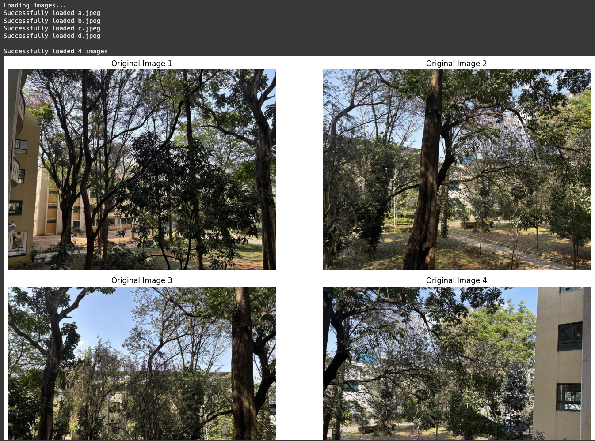
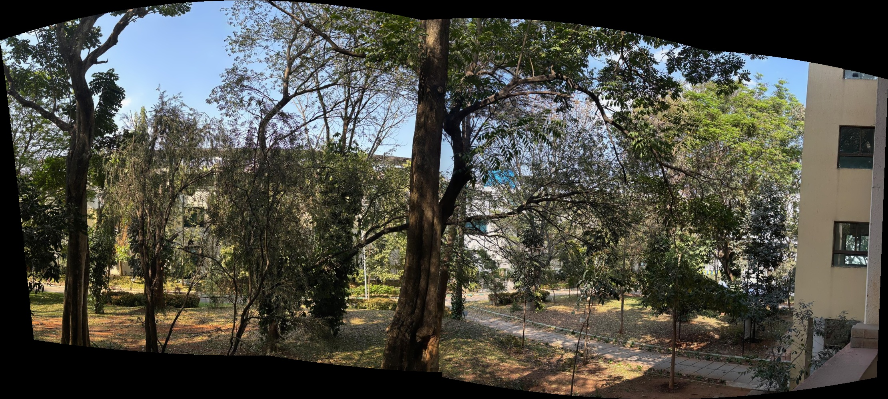

# VR_Assignment1_AshashreeSarma_MS2024005

# Computer Vision Assignment: Coin Detection and Panorama Creation

This repository contains the implementation of two computer vision tasks:
1. Detection and segmentation of Indian coins
2. Creation of panoramic images from overlapping photos

## README File Structure

This README is structured to provide a clear and comprehensive understanding of the project, following a logical sequence:

1. **Project Overview**  
   - A brief introduction to the two main tasks: Coin Detection & Segmentation and Panorama Creation.

2. **Project Structure**  
   - A directory tree representation of the repository layout to help users navigate through the files.

3. **Dependencies & Installation**  
   - Lists the required libraries and a simple command to install them.

4. **Part 1: Coin Detection and Segmentation**  
   - **Implementation Details**: Step-by-step explanation of each technique used, along with the necessity of each step.  
   - **Features**: Key functionalities, including detection, segmentation, and counting.  
   - **Flowchart**: A high-level process flow to visually represent the pipeline.  
   - **How to Run**: Instructions for executing the script in different environments.  
   - **Results**: Sample output images and detection accuracy.  
   - **Challenges Encountered in Coin Processing**: Insights from experimentation with different input images and potential improvements.
   - **Future Work & Enhancements**: Potential improvements, such as deep learning-based detection and advanced segmentation techniques.
   - **References and Conclusion**: Links of resources used and conclusion.

5. **Part 2: Panorama Creation**  
   - **Implementation Details**: Explanation of key functions used for feature detection, matching, and image stitching.
   - **Features**: Key functionalities, including detection, segmentation, and counting.  
   - **Flowchart**: A high-level process flow to visually represent the pipeline.  
   - **How to Run**: Instructions for executing the script in different environments.  
   - **Results**: Sample output images and detection accuracy.  
   - **Difficulties in Panorama Assembly**: Issues encountered during development and how they could be improved.
   - **Future Work & Enhancements**: Potential improvements.
   - **References and Conclusion**: Links of resources used and conclusion.


The README ensures that any new user can understand the project workflow, replicate results, and extend the functionality if needed.


## 1. Project Overview

This project focuses on two key computer vision tasks:

1. **Coin Detection and Segmentation**  
   - The goal is to detect Indian coins in an image, count them, and segment individual coins using computer vision techniques.  
   - The pipeline involves preprocessing, edge detection, contour analysis, and masking to extract and count coins.  
   - The output includes the total coin count and segmented coin images.

2. **Panorama Creation**  
   - This task involves stitching multiple overlapping images together to generate a seamless panoramic view.  
   - The implementation involves feature extraction, feature matching, homography estimation, and image warping.  
   - The final output is a blended panorama without noticeable seams.

Both tasks utilize OpenCV and NumPy for processing, with a focus on efficient and scalable implementations.


## 2. Project Structure

```
VR_Assignment1_AshashreeSarma_MS2024005/
├── src/
│   ├── coin_detection_and_segmentation.py
│   └── panorama.py
├── images/
│   ├── coins/
│   │   └── coinss.31.33 AM.png
│   └── panorama/
│       ├── a.jpeg
│       ├── b.jpeg
│       ├── c.jpeg
│       └── d.jpeg
├── results/
│   ├── coin_detection.png
│   ├── coin_segmentation.png
│   └── panorama_result.png
└── README.md
```

## 3. Dependencies and Installation

The project requires the following Python packages:
```
opencv-python>=4.8.0
numpy>=1.24.0
matplotlib>=3.7.0
```

To install dependencies:
```bash
pip install -r requirements.txt
```

##  Part 1: Coin Detection and Segmentation

### Implementation Details

The coin detection system follows a systematic approach to ensure accurate results:

1. **Grayscale Conversion**
   - Converts the image to grayscale to simplify processing and reduce computational load.
   - If omitted, color variations in coins and the background might interfere with edge detection, making the detection process unreliable.

2. **Gaussian Blur**
   - Applies a smoothing effect to remove noise, making coin boundaries clearer.
   - Without blurring, small textures and noise might create false detections, resulting in incorrect coin counting and segmentation.

3. **Edge Detection using Hough Circle Transform**
   - Detects circular objects (coins) by identifying contours and radius consistency.
   - If skipped, the system would struggle to differentiate between coins and non-circular objects, leading to false positives.

4. **Region-based Segmentation**
   - Isolates detected coins using binary masks to extract individual coins.
   - Without segmentation, overlapping coins or background noise may interfere with clear coin extraction.

### Features
1. **Coin Detection**
   - Uses edge detection with Hough Circle Transform to locate coins.
   - Green circles mark detected coins.
   - Adaptive parameter tuning for varying coin sizes.

2. **Segmentation**
   - Extracts individual coins using binary masks.
   - Background removal for clearer visualization.
   - Isolated coin images stored separately.

3. **Coin Counting**
   - Automatically counts detected coins.
   - Displays the total count in the console.
   - Segmented output verifies count accuracy.

#### Processing Flowchart:
```
[Input Image] → [Grayscale Conversion] → [Gaussian Blur] → [Edge Detection] → [Coin Detection] → [Segmentation] → [Coin Counting]
```

### How to Run

```bash
python src/coin_detection_and_segmentation.py
```

or run the script in Google Colab after uploading the images. Paths are predefined, requiring no additional configuration.

For VS Code execution, ensure images are placed in the correct directory structure as specified above.

### Results

The script produces three main outputs:
1. **Original image** with detected coins outlined in green.
2. **Segmented image** isolating the coins.
3. **Individual extracted coin images.**
4. **Total coin count displayed in the console.**

<p float="left">
  
  
</p>

Current detection accuracy: ~101 coins detected.

### Challenges Faced in Coin Processing
After trying on multiple input images with variations, here is my understanding:
- **Handling Overlapping Coins**: Some coins are difficult to detect if they overlap significantly, leading to undercounting or incorrect segmentation. More sophisticated segmentation techniques, such as watershed or deep learning-based methods, could help address this issue.
- **Inconsistent Lighting Conditions**: Uneven lighting affects segmentation and edge detection accuracy, causing missed detections or false positives. Adaptive thresholding or contrast enhancement techniques may improve performance.
- **Coin Reflection & Shadows**: Bright reflections can cause false detections, while shadows may obscure coin edges. Preprocessing techniques like histogram equalization could help balance illumination conditions.
- **Different Denominations and Diversity in Coin Features**: Some coins may have low contrast, making detection harder, especially if they blend with the background. Feature-based classification methods might be required for better robustness.

### Further Improvements
- Implement **Deep Learning-based object detection** (e.g., YOLO, Faster R-CNN) for better accuracy.
- Improve segmentation using **watershed algorithms** or **active contours**.
- Enhance robustness under poor lighting conditions using adaptive preprocessing.

### References
- Object Detection: https://www.projectpro.io/article/object-detection-project-ideas-with-source-code/490 , https://www.geeksforgeeks.org/object-detection-vs-object-recognition-vs-image-segmentation/
- Feature segmentation: https://www.geeksforgeeks.org/explain-image-segmentation-techniques-and-applications/, https://www.geeksforgeeks.org/image-segmentation-models/


---

##  Part 2: Panorama Creation

### Implementation Details

The panorama creation system utilizes:

1. **ORB (Oriented FAST and Rotated BRIEF)**
   - Detects keypoints and extracts feature descriptors.
   - If omitted, the system would lack critical features for alignment, making it impossible to match images effectively.

2. **BFMatcher (Brute Force Matcher)**
   - Matches feature descriptors between overlapping images.
   - Without it, images would not align properly due to a lack of correspondence, resulting in disjointed or misaligned panoramas.

3. **Homography Estimation (RANSAC)**
   - Computes transformations to align images, filtering out incorrect matches.
   - If skipped, image warping would be inaccurate, causing severe misalignment in the final panorama.

4. **Warping & Blending**
   - Warps images into a common perspective and blends overlapping regions.
   - Without proper blending, seams and artifacts would appear in the final panorama, making it visually unappealing.

### Features
1. **Keypoint Detection**
   - Uses ORB instead of SIFT (as SIFT is patented) for efficient feature detection.
   - Extracts keypoints and descriptors for image matching.

2. **Image Matching**
   - Matches keypoints using BFMatcher with Hamming distance.
   - Filters out bad matches to retain only strong correspondences.

3. **Image Stitching**
   - Computes a homography matrix for perspective transformation.
   - Warps images to align overlapping regions.
   - Blends images to create a seamless panorama.

#### Processing Flowchart:
```
[Input Images] → [Keypoint Detection] → [Feature Matching] → [Homography Computation] → [Warping] → [Blending] → [Final Panorama]

```

### How to Run

```bash
python src/panorama.py
```

or run the file in Google Colab after uploading the images. The paths are predefined, so no additional setup is needed.

For running in VS Code, place the input images in the correct folder structure, and the program should run without any additional modifications.

### Results

The script produces:
1. Visualization of original input images
2. Images with detected keypoints
3. Final stitched panorama

   <p float="left">
  
  
  
</p>

### Observations

- Successful stitching requires sufficient overlap between images
- Best results achieved with consistent lighting and minimal movement
- SIFT provides robust feature detection across different scenes


### Challenges Faced in Panoroma Assembly
After trying on multiple input images with variations, here is my understanding:
- **Inconsistent Feature Matching**: ORB does not always provide as strong matches as SIFT, leading to incorrect alignments. Using advanced feature extractors could improve matching.
- **Illumination Differences**: Differences in exposure can create visible seams in the panorama. Exposure correction techniques could mitigate this issue.
- **Limited Overlapping Regions**: If images have too little overlap, homography estimation fails, breaking the panorama. Capturing images with more overlap can help.
- **Perspective Warping Artifacts**: Wide-angle images can lead to unwanted distortions, making the stitched output unnatural. Applying cylindrical or spherical projections might improve results.

### References
- OpenCV Documentation: https://docs.opencv.org/4.x/index.html
- Feature Matching Techniques: https://www.geeksforgeeks.org/feature-matching-in-computer-vision-techniques-and-applications/, https://medium.com/@deepanshut041/introduction-to-feature-detection-and-matching-65e27179885d
- Image Stitching Algorithms: https://www.geeksforgeeks.org/image-stitching-with-opencv/, https://paperswithcode.com/task/image-stitching
